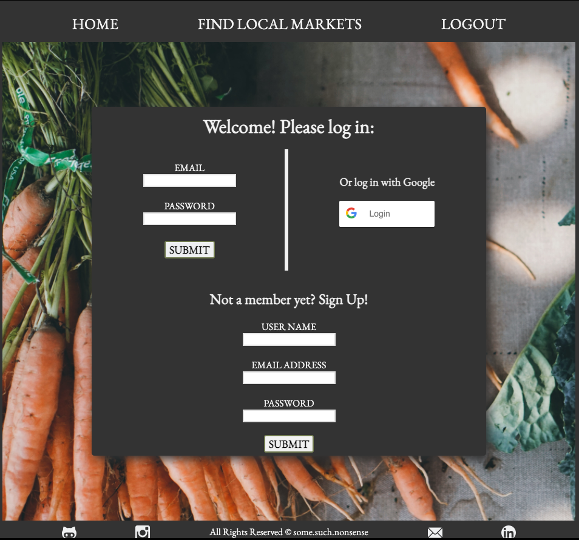
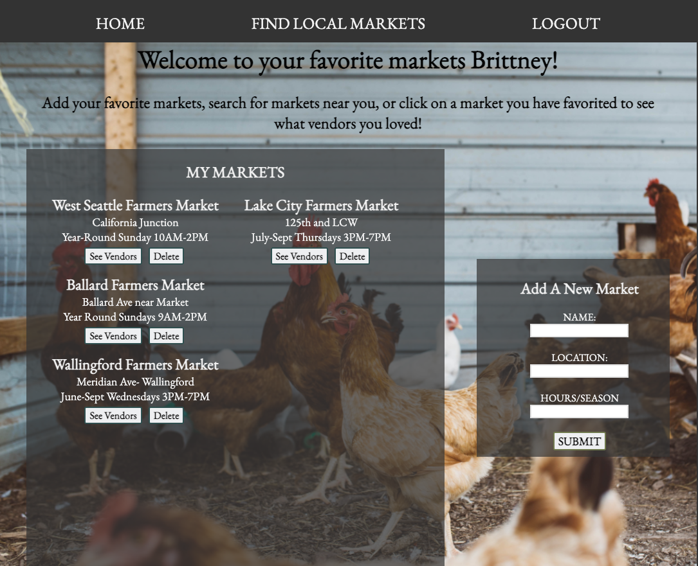

[![Contributors][contributors-shield]][contributors-url]
[![Forks][forks-shield]][forks-url]
[![Stargazers][stars-shield]][stars-url]
[![Issues][issues-shield]][issues-url]
[![MIT License][license-shield]][license-url]
[![LinkedIn][linkedin-shield]][linkedin-url]


<!-- PROJECT LOGO -->
<br />
<p align="center">
  <a href="https://github.com/pollipayne/farmers-market-front-end">
    
  </a>

  <h3 align="center"> My Farmers Market </h3>

  <p align="center">
    My Farmers Market is a client side web application meant to be used in tandem with the "My Farmers Market" REST-ful API located 
     <a href="https://github.com/pollipayne/farmers-market-back-end"> here </a>.  It is built to allow users a personalized environment to track and save information on their favorite local markets, vendors and products, as well as searching for new markets in their area utilizing the USDA Farmers Market API. 
    <br />
    <a href="https://github.com/pollipayne/farmers-market-front-end"><strong>Explore the docs »</strong></a>
    <br />
    <br />
    <a href="https://my-farmers-market-fe.herokuapp.com/">View Demo</a>
    ·
    <a href="https://github.com/pollipayne/farmers-market-front-end/issues">Report Bug</a>
    ·
    <a href="https://github.com/pollipayne/farmers-market-front-end/issues">Request Feature</a>
  </p>
</p>


<!-- TABLE OF CONTENTS -->
<details open="open">
  <summary><h2 style="display: inline-block">Table of Contents</h2></summary>
  <ol>
    <li>
      <a href="#about-the-project">About The Project</a>
      <ul>
        <li><a href="#built-with">Built With</a></li>
      </ul>
    </li>
    <li>
      <a href="#getting-started">Getting Started</a>
      <ul>
        <li><a href="#prerequisites">Prerequisites</a></li>
        <li><a href="#installation">Installation</a></li>
      </ul>
    </li>
    <li><a href="#usage">Usage</a></li>
    <li><a href="#roadmap">Roadmap</a></li>
    <li><a href="#contributing">Contributing</a></li>
    <li><a href="#license">License</a></li>
    <li><a href="#contact">Contact</a></li>
    <li><a href="#acknowledgements">Acknowledgements</a></li>
  </ol>
</details>


<!-- ABOUT THE PROJECT -->
## About The Project
<p align="center" >
 
 </p>

Built on top of a RESTful API composed in TypeScript on an Express framework with PSQL and TypeOrm database management.  Users (whether logged in or not) can search for local farmers markets via zip-code query.  Logged in users can add favorited markets to their database, and for each market associate a favorited vendor located within that market.  For each vendor model, users can also assign favorite products, and the season those products are available. 


### Built With

* [TypeScript]("https://www.npmjs.com/package/typescript")
* [NodeJS]("https://nodejs.org/en/download/")
* [npm]("https://www.npmjs.com/package/npm")
* [React]("https://www.npmjs.com/package/react")
* [Axios]("https://www.npmjs.com/package/axios")


<!-- GETTING STARTED -->
## Getting Started

To get a local copy up and running follow these simple steps.

### Prerequisites

This is an example of how to list things you need to use the software and how to install them.
* npm
  ```sh
  npm install -g npm
  ```

* NodeJS - download <a href="https://nodejs.org/en/download/">HERE </a>


### Installation

1. Clone the repo
   ```sh
   git clone https://github.com/pollipayne/farmers-market-front-end.git
   ```
2. Install NPM packages
   ```sh
   npm install 
   ```
3. Start the server 
   ```sh
   npm start
   ```
4. Create a new <a href='https://console.cloud.google.com/'> Google project </a> and add a .env file with your ```CLIENT_ID``` to the project root directory. 


<!-- ROADMAP -->
## Roadmap

Proposed features and future development include:

* Google Maps integration
* Recipe search integration  (via <a href="https://developer.edamam.com/edamam-docs-recipe-api"> Edamam-API </a>)
* Allowing users to add new markets to the database by selecting from the search feature.  


<!-- CONTRIBUTING -->
## Contributing

Contributions are what make the open source community such an amazing place to be learn, inspire, and create. Any contributions you make are **greatly appreciated**.

1. Fork the Project
2. Create your Feature Branch (`git checkout -b feature/AmazingFeature`)
3. Commit your Changes (`git commit -m 'Add some AmazingFeature'`)
4. Push to the Branch (`git push origin feature/AmazingFeature`)
5. Open a Pull Request


<!-- LICENSE -->
## License

Distributed under the MIT License. See `LICENSE` for more information.


<!-- CONTACT -->
## Contact

Brittney Payne - [@LinkedIn]("https://www.linkedin.com/in/brittney-payne-1824701b7/") - brpayne598@gmail.com

Project Link: [https://github.com/pollipayne/farmers-market-front-end](https://github.com/pollipayne/farmers-market-front-end)


<!-- ACKNOWLEDGEMENTS -->
## Acknowledgements

* [Ada Developers Academy]("https://adadevelopersacademy.org/organization/")
* [USDA Farmers Market API]("https://search.ams.usda.gov/farmersmarkets/v1/svcdesc.html")
* [UnSplash Images]("https://unsplash.com/license")


<!-- MARKDOWN LINKS & IMAGES -->
<!-- https://www.markdownguide.org/basic-syntax/#reference-style-links -->
[contributors-shield]: https://img.shields.io/github/contributors/pollipayne/farmers-market-front-end.svg?style=for-the-badge
[contributors-url]: https://github.com/pollipayne/farmers-market-front-end/graphs/contributors
[forks-shield]: https://img.shields.io/github/forks/pollipayne/farmers-market-front-end.svg?style=for-the-badge
[forks-url]: https://github.com/pollipayne/farmers-market-front-end/network/members
[stars-shield]: https://img.shields.io/github/stars/pollipayne/farmers-market-front-end.svg?style=for-the-badge
[stars-url]: https://github.com/pollipayne/farmers-market-front-end/stargazers
[issues-shield]: https://img.shields.io/github/issues/pollipayne/farmers-market-front-end.svg?style=for-the-badge
[issues-url]: https://github.com/pollipayne/farmers-market-front-end/issues
[license-shield]: https://img.shields.io/github/license/pollipayne/farmers-market-front-end.svg?style=for-the-badge
[license-url]: https://github.com/pollipayne/farmers-market-front-end/blob/master/LICENSE.txt
[linkedin-shield]: https://img.shields.io/badge/-LinkedIn-black.svg?style=for-the-badge&logo=linkedin&colorB=555
[linkedin-url]: https://www.linkedin.com/in/brittney-payne-1824701b7/
[Product Name Screen Shot]: 